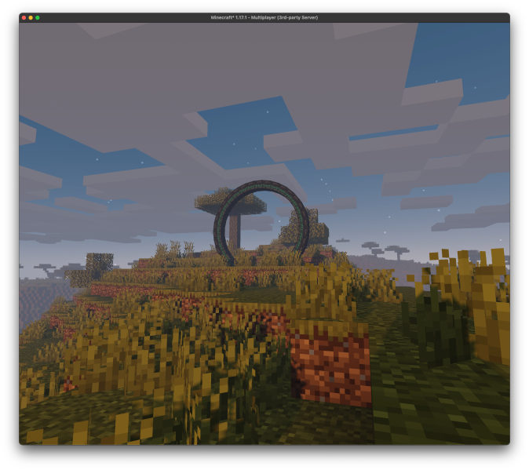
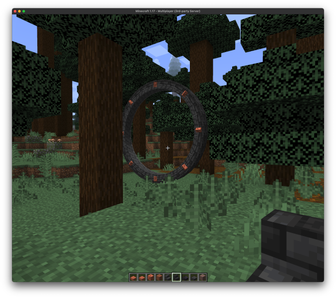
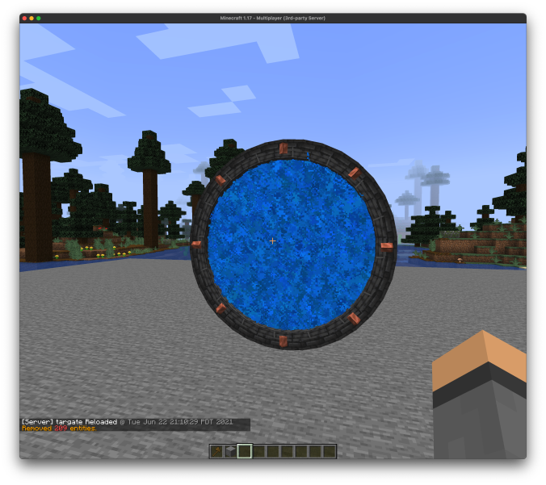

# Stargate

## Upgraded Portal

Allows travel between overworld, end, and nether. Can be obtained by right-clicking a standard portal with a nether
star.

## Standard Portal

Allows travel only in departure world.

